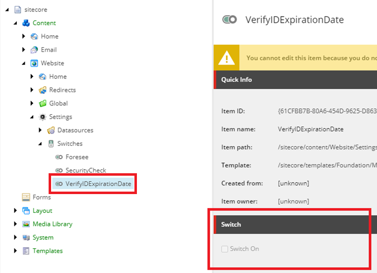
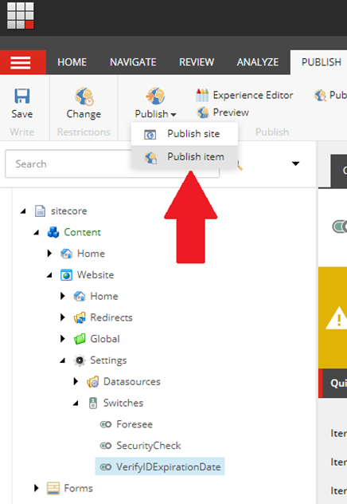
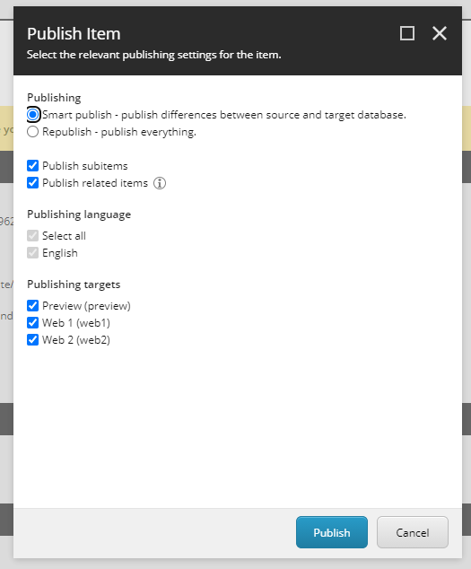

## Online Banking Platform (version 20.05.24)

### (Internal) Hotfix Release - May 28, 2020 

### Overview

On March 13, 2020, a national emergency was declared under 42 U.S.C. § 5191(b) in response to COVID-19 (Coronavirus Disease 2019). 

As a result, many State Driver's Licensing Agencies (SDLAs) have closed or reduced their hours of operation.

This hotfix release addresses the challenge of validating forms of identification during the online account origination process when those forms of identification might be expired. 

### New feature - Verify ID Expiration Date switch

The Verify ID Expiration Date switch is a new switch in Sitecore that allows for toggling the expiration date validation for driver’s licenses, state IDs, and other forms of identification on or off. When this switch is on, the expiration date field for forms of identification will be validated to ensure the expiration date is in the future. When the switch is off, the expiration date field will still be required, but will not be validated to ensure the date is a future date.

### How to toggle the Verify ID Expiration Date switch

Toggling the switch is done on the Sitecore content management server.

The path to the switch is: 
`/sitecore/content/Website/Settings/Switches/VerifyIDExpirationDate`

**Step 1:** Select the VerifyIDExperiationDate item.

**Step 2**: Toggle the switch to turn id expiration verification on or off.

- To turn verification *ON*, select **Switch On**. 

- To turn verification *OFF*, clear **Switch On**.

**Step 3:** With the VerifyIDExperiationDate item selected, click **Publish** then select **Publish item.**

**Step 4:**  In the **Publish Item** dialog, select the following settings: 

*Publishing*

- **Smart publish**
- **Publish subitems**
- **Publish related items**

*Publishing targets*

- **Preview (preview)**
- **Web 1 (web1)**
- **Web 2 (web2)**

**Step 5:** Click **Publish.** When publishing completes, the number of items processed, created, deleted or updated will display.
